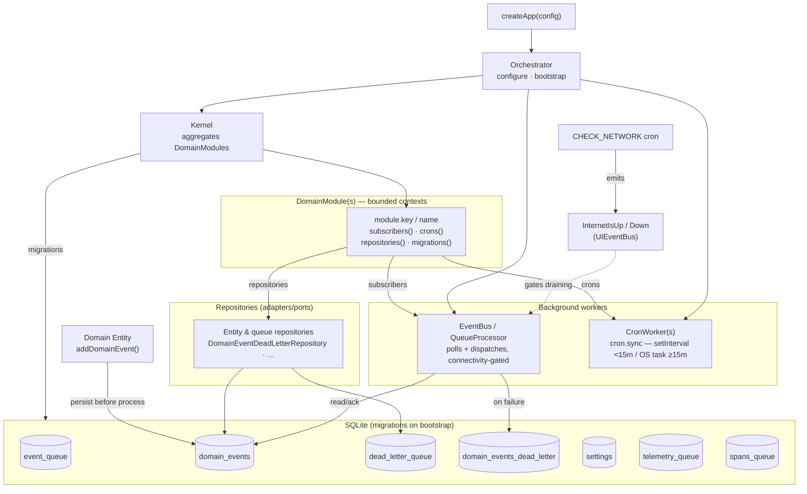
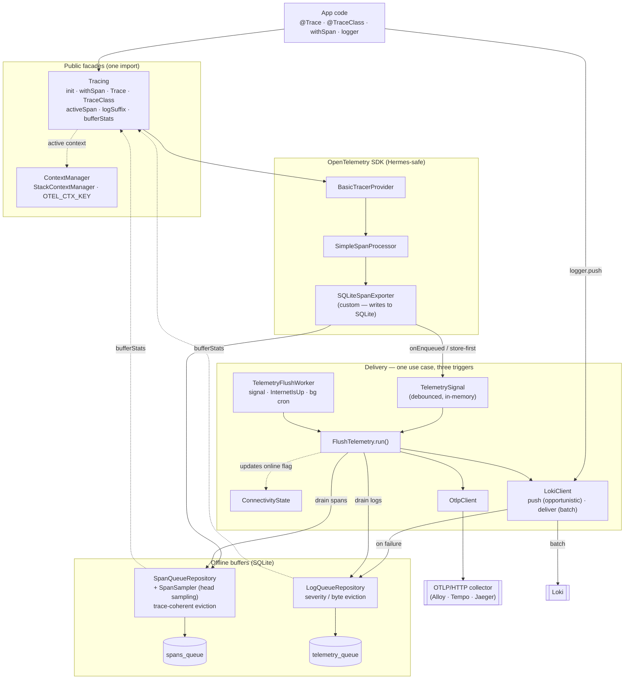

# @sincpro/mobile

**Enterprise mobile application framework for React Native / Expo** — built on hexagonal architecture, domain-driven design, and offline-first infrastructure.

Enterprise mobile development has always been hard. Applications need to work without internet, recover from failures gracefully, sync data when connectivity returns, manage authentication state, handle background tasks, print documents, and do all of this across iOS and Android with a single codebase. Each project that solves these problems from scratch solves them differently — and then someone has to maintain those differences forever.

`@sincpro/mobile` is Sincpro's answer to that problem. This framework encodes proven enterprise patterns once — event queues, dead-letter queues, domain event sourcing, offline-first storage, cron workers, adapter ports — and every app built on it inherits those capabilities by default.

**Sincpro maintains this.** The source is open and anyone can read it. What Sincpro provides is the commitment behind it: stable contracts, long-term API support, updates as platforms evolve, and people accountable for the behaviors your business depends on. This is not a project that gets abandoned. It is infrastructure for the new era of enterprise mobile development, and Sincpro intends to maintain it for the teams and clients that build on top of it.

> **AI agent?** Read [`AGENTS.md`](AGENTS.md) first — ecosystem orientation, patterns, and traps. Known runtime issues live in [`docs/GOTCHAS.md`](docs/GOTCHAS.md).
>
> **Deep engineering docs** (component + sequence diagrams, design rationale) live in [`docs/`](docs/README.md): [core architecture](docs/architecture-core.md), [telemetry](docs/architecture-telemetry.md), and the [consumer app structure](docs/architecture-consumer.md). This README is the summary.

---

## ⚡ Quick Start

Here is the minimum to get a working enterprise app running:

```bash
npx expo install @sincpro/mobile @sincpro/mobile-ui
```

```tsx
// 1. Define your domain module
import { DomainModule } from "@sincpro/mobile/framework/domain_module";
import type { Subscriber } from "@sincpro/mobile/domain/event_sourcing";
import type { CronWorker } from "@sincpro/mobile/infrastructure/workers";

class SalesModule extends DomainModule {
  readonly key = "SALES";
  readonly name = "Sales";

  override subscribers(): Subscriber[] {
    return SalesSubscribers;
  }
  override crons(): CronWorker[] {
    return SalesCronJobs;
  }
}

const salesModule = new SalesModule();

// 2. Wire the app shell — one call does everything
import { createAppShell, createTheme } from "@sincpro/mobile";

export default createAppShell({
  theme: createTheme({ accent: "#0EA5E9" }),
  domains: [salesModule],
  ui: { [salesModule.key]: SalesScreen },
  activeDomain: salesModule.key,
});
```

`createAppShell` runs database migrations, starts the event queue, registers cron workers, applies the theme, loads fonts, and mounts the app — all from a single configuration object.

---

## 📑 Table of Contents

1. [Why This Framework Exists](#why-this-framework-exists)
2. [Architecture Overview](#architecture-overview)
3. [Ecosystem](#ecosystem)
4. [Key Features](#key-features)
5. [Creating a DomainModule](#creating-a-domainmodule)
6. [AppShell Configuration](#appshell-configuration)
7. [Theme Configuration](#theme-configuration)
8. [Brand Font Configuration](#brand-font-configuration)
9. [Public API](#public-api)
10. [Telemetry Architecture](#telemetry-architecture)
11. [Subpaths](#subpaths)
12. [Development](#development)

---

## 🔍 Why This Framework Exists

### The Enterprise Mobile Problem

Building a business mobile application is not the same as building a consumer app. Business apps need to work in warehouses with no Wi-Fi. They need to print receipts to Bluetooth thermal printers. They need to sync order data when the connection comes back, in the right order, without duplicates. They need to run background jobs that don't drain the battery. They need authentication that safely clears sensitive data on logout. They need dark and light themes that match the brand manual. They need to ship fast and be maintained for years.

None of this is hard in isolation. All of it together, across iOS and Android, from scratch, for every project — is expensive, inconsistent, and difficult to maintain.

### The AI Era Problem

AI tools can generate code faster than ever. That makes the absence of a framework _more_ dangerous, not less. When there is no shared architecture, AI-generated code is consistent only with itself — each prompt produces a different pattern, a different naming convention, a different approach to the same problem. The velocity is real. The maintenance cost is also real.

With `@sincpro/mobile`, AI tools have clear patterns to follow: `DomainModule`, `createAppShell`, `Subscriber`, `CronWorker`, `Entity.addDomainEvent`. Code generated within the framework is framework-compliant by default. Human reviewers can audit it quickly. The codebase stays navigable.

### The Multi-Platform Bet

React Native and Expo are the right foundation for enterprise cross-platform mobile in 2025 and beyond. A single TypeScript codebase, native performance, the full JavaScript ecosystem, and Expo's managed platform for OTA updates and native modules. Sincpro commits to maintaining the enterprise layer on top of this foundation as it evolves — consumers get platform upgrades without rewriting their business logic.

### What Sincpro Provides

Open-source software is valuable. Maintained open-source software is rare. The difference is people: engineers who triage issues, update dependencies, handle platform breaking changes, document traps they found in production, and preserve behavioral contracts across major versions.

Sincpro builds and maintains `@sincpro/mobile` because we build and support the clients that run on it. When a behavior breaks, we fix it. When Expo upgrades their SDK, we absorb the migration. When a new enterprise pattern proves itself in production, we promote it into the framework so every app inherits it. That is the commitment.

---

## 🏗️ Architecture Overview

The framework is organized in strict layers with enforced one-way dependency flow:

```
┌─────────────────────────────────────────────────────┐
│              Business Apps                          │
│    sincpro-mobile-tickets / distribution / …        │
└────────────────────────┬────────────────────────────┘
                         │
┌────────────────────────▼────────────────────────────┐
│           @sincpro/mobile-odoo  (optional)          │
│         OdooClient · Auth · Partner sync            │
└────────────────────────┬────────────────────────────┘
                         │
┌────────────────────────▼────────────────────────────┐
│              @sincpro/mobile  ◄── YOU ARE HERE       │
│                                                     │
│  framework/      DomainModule · Kernel · Orchestrator│
│  domain/         Entity · Event Sourcing · Ports    │
│  infrastructure/ EventBus · CronWorker · DLQ        │
│  adapters/       Network · Bluetooth · Geo · WebView│
│  services/       Printer · DLQ · Events · Network  │
│  entrypoints/    AppShell · DB · Queue · Cron       │
└────────────────────────┬────────────────────────────┘
                         │
┌────────────────────────▼────────────────────────────┐
│              @sincpro/mobile-ui                     │
│         Design System — no domain knowledge         │
└─────────────────────────────────────────────────────┘
```

### Key Architectural Principles

- **Hexagonal Architecture (Ports and Adapters).** The domain layer defines interfaces (`IPrinterDriver`, `IRepository`). Concrete implementations live outside and are injected. The core never imports hardware SDKs.
- **Domain-Driven Design.** Each bounded context is a `DomainModule`. The framework orchestrates them; they never know about each other.
- **Offline-First.** Every domain event is persisted to SQLite before it is processed. Events survive app restarts and process them on recovery.
- **Strict layer boundaries.** A lower layer cannot import from a higher one. `mobile-ui` has no imports from `@sincpro/mobile`.

### Base infrastructure — events, queues, repositories, orchestrator

`createApp` configures the **Orchestrator**, which bootstraps the **Kernel** (the set of `DomainModule`s). Each module contributes subscribers, crons, repositories and migrations; the orchestrator wires them and starts the workers. Everything durable is a SQLite-backed queue drained by a worker — offline-first by construction.



---

## 🗂️ Ecosystem

| Package                | Role                                                                 |
| ---------------------- | -------------------------------------------------------------------- |
| `@sincpro/mobile`      | Core framework: infrastructure, DDD patterns, `AppShell`             |
| `@sincpro/mobile-ui`   | Standalone design system (no domain logic)                           |
| `@sincpro/mobile-odoo` | **Optional** Odoo 17 integration (OdooClient, auth, partner, server) |
| `sincpro-mobile-<app>` | Business apps (tickets, distribution) that compose the above         |

Dependency direction is enforced: apps use everything; `mobile-ui` knows nothing upstream.

---

## 🔑 Key Features

### ✅ Module-Driven Architecture

Each bounded context is a class that extends `DomainModule`. It declares its own repositories, migrations, subscribers, and cron workers. The `Kernel` aggregates them all; the `Orchestrator` manages their lifecycle. The core never changes when a domain is added or removed.

```tsx
class InvoiceModule extends DomainModule {
  readonly key = "INVOICE";
  readonly name = "Invoice";

  override repositories() {
    return {
      invoiceRepo: new InvoiceRepository(),
      invoiceLineRepo: new InvoiceLineRepository(),
    };
  }

  override migrations(): IMigration[] {
    return [CreateInvoicesTable, CreateInvoiceLinesTable];
  }

  override subscribers(): Subscriber[] {
    return [InvoiceCreatedSubscriber, InvoiceVoidedSubscriber, SyncInvoiceSubscriber];
  }

  override crons(): CronWorker[] {
    return [SyncPendingInvoicesCron];
  }

  // Tables to preserve when the domain is wiped (e.g. on logout)
  override persistOnReset(): string[] {
    return ["invoice_templates"];
  }
}
```

### ✅ Offline-First Event Queue

Every domain event is persisted to SQLite before any subscriber processes it. If the app is killed mid-processing, the event is replayed on restart. Events requiring network connectivity are held until connectivity returns.

**Poll cycle:** EventBus polls every **800ms**, with exponential backoff (×1.5 multiplier, max **30s**) when the queue is empty or the device is offline. The interval resets immediately when a new event is published or connectivity is restored.

```tsx
import { Entity } from "@sincpro/mobile/domain/entity";

class Order extends Entity {
  status = "pending";

  confirm() {
    this.status = "confirmed";
    // Persisted to SQLite before processig — survives app restart
    this.addDomainEvent(OrderConfirmedEvent, { orderId: this.uuid });
  }
}

// Subscriber processes the event asynchronously
class OrderConfirmedSubscriber extends Subscriber {
  listen = [OrderConfirmedEvent];
  requiresAuth = true;

  async process(event: OrderConfirmedEvent): Promise<void> {
    await syncOrderToServer(event.orderId);
  }
}
```

### ✅ Dead Letter Queue (DLQ)

Events that exceed the maximum retry attempts (`MAX_ATTEMPTS = 1` per cycle) are automatically moved to the dead letter queue with the full error message and failure timestamp. Operations teams can inspect, retry in bulk, or permanently delete failed events.

```tsx
import { deadLetterQueueUseCases } from "@sincpro/mobile/services/dlq.service";

// Inspect failed events
const failed = await deadLetterQueueUseCases.getFailedEvents();

// Retry a single event (fresh uuid, reset attempts)
await deadLetterQueueUseCases.retryFailedEvent(failed[0]);

// Bulk retry — returns { success: number, failed: number }
const result = await deadLetterQueueUseCases.retryMultipleFailedEvents(failed);

// Remove permanently
await deadLetterQueueUseCases.deleteFailedEvent(failed[0]);
```

### ✅ Domain Entity with Event Sourcing

`Entity` is the aggregate root. It collects domain events during a business operation and publishes them atomically. Events carry tracing fields (`correlationId`, `aggregateId`, `sequence`) for transaction support and SAGA patterns.

```tsx
import { Entity } from "@sincpro/mobile/domain/entity";

class Invoice extends Entity {
  remoteId?: string;
  status: "draft" | "sent" | "paid" = "draft";
  lines: InvoiceLine[] = [];

  addLine(line: InvoiceLine) {
    this.lines.push(line);
    // correlationId groups all events from this operation
    this.addDomainEvent(InvoiceLineAddedEvent, { invoiceId: this.uuid, lineId: line.uuid });
  }

  send() {
    this.status = "sent";
    // All events from this call share the same correlationId and sequence
    this.addDomainEvent(InvoiceSentEvent, { invoiceId: this.uuid, sentAt: new Date() });
    await this.publishAllDomainEvents();
  }
}
```

**Entity lifecycle methods:**

| Method                            | Description                                                                   |
| --------------------------------- | ----------------------------------------------------------------------------- |
| `addDomainEvent(Event, payload?)` | Enqueues an event with auto-assigned aggregateId, correlationId, and sequence |
| `addDomainEventWithEntity(Event)` | Enqueues event with the entire entity as the `record` field                   |
| `publishAllDomainEvents()`        | Async: persists all pending events, clears the internal queue                 |
| `publishAllDomainEventsSync()`    | Sync: publishes immediately, throws on any failure                            |
| `copyDomainEventsFrom(source)`    | Transfers events from another entity (re-aggregating)                         |

### ✅ Remote Entity Sync

`RemoteEntity` extends `Entity` with sync state tracking for entities that mirror data from a remote server. It manages the full lifecycle from pending local creation to confirmed remote sync.

```tsx
import { RemoteEntity } from "@sincpro/mobile/domain/entity";

class Product extends RemoteEntity {
  name: string = "";
  price: number = 0;
  // remoteState: "SYNCED" | "PENDING" | "FAILED"
  // remoteId?: string — the server's ID once synced

  static fromApiResponse(data: ApiProduct): Product {
    return Product.fromRemoteDTO(data);
  }

  syncWithServer(updated: ApiProduct) {
    this.mergeWithRemote(updated); // preserves uuid + eventIds
    this.markAsSynced();
  }

  toApiPayload() {
    return this.remotePayload(); // serializes to API format
  }
}
```

### ✅ Background Cron Workers

`CronWorker` schedules recurring background tasks. Workers under 15 minutes use `setInterval` (foreground); workers at or above 15 minutes register with `expo-background-task` for true background execution.

```tsx
import { CronWorker } from "@sincpro/mobile/infrastructure/workers";

const SyncInvoicesCron = new CronWorker(
  "sync-invoices", // task name (must be globally unique)
  async () => {
    const pending = await invoiceRepo.findPendingSync();
    for (const invoice of pending) {
      await apiClient.syncInvoice(invoice);
    }
  },
  15, // interval in minutes (>= 15 → background capable)
  true, // requiresAuth — won't run if the session is unauthenticated
);
```

The `Orchestrator` starts, stops, and re-syncs workers automatically when domains are activated/deactivated or when the authentication state changes.

### ✅ Authentication Lifecycle

The `Orchestrator` manages a global authentication state that gates subscribers and cron workers. Marking the session unauthenticated can optionally wipe the event queue and reset the database — leaving only the tables declared in `persistOnReset()`.

```tsx
import { orchestrator } from "@sincpro/mobile";

// User signs in
await orchestrator.authenticateSession();
// → Re-syncs queue subscribers and cron workers for active domains

// User signs out — clears queue + resets DB (except persisted tables)
await orchestrator.unauthenticateSession(true);

// Resume after app goes to background and returns
await orchestrator.restoreSession();
// → Drains the event queue and re-syncs crons

// Domain enable / disable at runtime
await orchestrator.enableDomain("ODOO");
await orchestrator.disableDomain("ODOO");
```

All state transitions are protected by a mutex — concurrent calls are serialized.

### ✅ Connectivity Awareness

The framework knows whether the device has internet access and routes work accordingly. Events marked `requiresNetwork = true` are held in the queue until connectivity is confirmed. Subscribers can respond directly to connectivity changes via domain events.

```tsx
class SyncOrderEvent extends DomainEvent {
  static requiresNetwork = true; // Won't process while offline
}

// Check status at any point
import { networkUseCases } from "@sincpro/mobile/services/network.service";

const status = await networkUseCases.getNetworkStatus();
// { isConnected: boolean, isInternetReachable: boolean | null, type: "wifi"|"cellular"|…, ipAddress }
```

The EventBus subscribes to `InternetIsDownEvent` / `InternetIsUpEvent` internally — when connectivity is lost it increases the poll interval, and when it is restored it resets to 800ms and drains any held events immediately.

### ✅ Telemetry & Observability (OpenTelemetry + Loki)

Distributed tracing and structured logs, **offline-first**, built on the OpenTelemetry SDK. Spans buffer to SQLite and ship to any OTLP/HTTP collector (Grafana Alloy, Tempo, Jaeger); logs ship to Loki. Telemetry is **opt-in** — pass a `telemetry` config to `createApp`.

```tsx
await createApp({
  telemetry: {
    loki: {
      endpoint: "https://loki.acme.com",
      labels: { app: "pos", env: "prod", tenant: "acme" },
      // Standard auth shortcut…
      auth: { type: "bearer", token: "…" },
      // …or any custom gateway headers (merged after auth, win on conflict)
      headers: { "sincpro-api-key": "…", "X-Scope-OrgID": "acme" },
    },
    otlp: {
      endpoint: "https://alloy.acme.com",
      headers: { Authorization: "Bearer …" },
    },
    flush: {
      backgroundIntervalMin: 15, // 0 disables the background cron
      onConnectivityEvents: true, // drain the backlog the moment the network returns
      sendTimeoutMs: 4000, // fail fast instead of hanging while offline
    },
  },
});
```

**One import, simple API.** The `Tracing` facade is the single entry point for custom instrumentation:

```tsx
import { Tracing } from "@sincpro/mobile/infrastructure/telemetry";

// Manual span block — start/end/error handled for you
await Tracing.withSpan("checkout.process", async (span) => {
  span.setAttribute("order.id", order.id);
  await processOrder(order);
});

// Or decorate — a span per invocation, parent context propagated automatically
class CheckoutUseCase {
  @Tracing.Trace()
  async process(order: Order) {
    /* … */
  }
}

@Tracing.TraceClass("checkout") // a span per public method + context propagation
class InventoryService {
  /* … */
}

// Correlate your own logs with the active trace
logger.info("charge attempt" + Tracing.logSuffix()); // → " trace_id=… span_id=…"

// Inspect offline backlog pressure (health checks / dashboards)
const stats = await Tracing.bufferStats();
// { logs:  { rows, approxBytes, dropped, sampled },
//   spans: { rows, approxBytes, dropped, sampled } }
// dropped = evicted after buffering (back-pressure);
// sampled = refused at ingest by head sampling (load shed, spans only)
```

See [Telemetry Architecture](#telemetry-architecture) for the delivery and retention design and the reasoning behind it.

### ✅ Bluetooth Printer Integration

The printer port (`IPrinterDriver`) is defined by the framework; the concrete driver is registered by the app. The `PrinterService` wraps it with connection management, permission handling, and a grace-reconnect strategy.

```tsx
// Register the adapter before AppShell boots
import { printerService } from "@sincpro/mobile/services/printer.service";
import { PrinterAdapter } from "./adapters/Printer.adapter"; // your Bluetooth impl

printerService.setDriver(PrinterAdapter);

// Then use the service anywhere
await printerService.connect(deviceAddress, "Printer Name");
await printerService.printText("=== RECEIPT ===\nItem: Widget\nTotal: $12.00");
await printerService.printImageBase64(base64Png);
await printerService.printHtml(htmlString); // converts to PDF (576px thermal width)

// Capture a React Native view and print it
await printerService.printFromView(receiptViewRef);
```

**Grace reconnect:** If printing fails, the service automatically disconnects, reconnects to the last saved printer, and retries once — without surfacing the error to the user.

### ✅ WebView Print Interception

The framework ships injectable scripts that intercept `window.print()` calls inside a WebView, capture the document as a PNG via `html2canvas`, and forward it to React Native for Bluetooth printing.

```tsx
import { WebViewAdapter } from "@sincpro/mobile/adapters/webview";

<WebView
  injectedJavaScriptBeforeContentLoaded={WebViewAdapter.getDefaultInterceptors()
    .map((s) => s.script)
    .join("\n")}
  onMessage={({ nativeEvent }) => {
    // Framework base_module handles PRINT_IMAGE automatically
    // via ProcessWebViewMessageSubscriber → PrintImageSubscriber
    EventBus.publishSync(new WebViewMessageReceivedEvent({ raw: nativeEvent.data }));
  }}
/>;
```

Available interceptors: `printInterceptor` (default), `ajaxInterceptor` (debug), `contentHeightReporter`.

### ✅ Activity Monitoring

`useCommon()` exposes real-time visibility into queue and cron activity — what is running, what failed, and how long it has been running. Use this to build status indicators, loading states, and error recovery UI.

```tsx
import { useCommon } from "@sincpro/mobile";

function StatusBar() {
  const { currentActivity, lastError, isProcessing, dismiss } = useCommon();

  if (lastError)
    return (
      <Banner variant="error" onDismiss={dismiss}>
        {lastError.label} failed: {lastError.error}
      </Banner>
    );

  if (isProcessing) return <ActivityIndicator label={currentActivity?.label ?? "Working…"} />;

  return null;
}
```

**`ICommonContext` full shape:**

| Field                    | Type                            | Description                              |
| ------------------------ | ------------------------------- | ---------------------------------------- |
| `currentActivity`        | `Activity \| undefined`         | Currently running queue or cron task     |
| `lastError`              | `Activity \| undefined`         | Last failed task (auto-clears after 10s) |
| `isProcessing`           | `boolean`                       | True while any task is active or errored |
| `dismiss()`              | `() => void`                    | Clears `lastError`                       |
| `debugMode`              | `boolean`                       | Developer debug toggle (persisted)       |
| `colorScheme`            | `"light" \| "dark" \| "system"` | Current color scheme (persisted)         |
| `setColorScheme(scheme)` | function                        | Switches theme + persists preference     |
| `timezone`               | `string \| null`                | Persisted timezone setting               |
| `updateTimezone(tz)`     | function                        | Updates and persists                     |
| `hasGeoPermission`       | `boolean`                       | Current geo permission state             |
| `requestGeoPermission()` | `async () => boolean`           | Requests location permission             |
| `checkGeoPermission()`   | `async () => void`              | Rechecks without prompting               |

### ✅ Domain Switcher

Apps that compose multiple domains can switch the active UI at runtime without any navigation library setup. The domain that is not displayed is still running — its queue subscribers and cron workers remain active.

```tsx
import { useDomainSwitcher } from "@sincpro/mobile";

function AppSwitcher() {
  const { activeDomain, switchTo } = useDomainSwitcher();

  return (
    <Navigation.SegmentedControl
      value={activeDomain}
      options={[
        { value: "TICKETS", label: "Tickets" },
        { value: "ODOO", label: "Odoo" },
      ]}
      onChange={switchTo}
    />
  );
}
```

### ✅ Global Error Handling

`DomainException` instances that escape to the React root are bridged to native `Alert` dialogs automatically:

```tsx
import { installGlobalErrorHandler } from "@sincpro/mobile";

// Call once before createAppShell
installGlobalErrorHandler();
```

---

## 🛠️ Creating a DomainModule

A `DomainModule` is the primary building block. Here is how to create one from scratch:

### Step 1 — Define the module class

```tsx
import { DomainModule } from "@sincpro/mobile/framework/domain_module";
import type { Subscriber } from "@sincpro/mobile/domain/event_sourcing";
import type { CronWorker } from "@sincpro/mobile/infrastructure/workers";
import type { IMigration } from "@sincpro/mobile/domain/database";

export class TicketsModule extends DomainModule {
  readonly key = "TICKETS"; // unique — used as the ui map key
  readonly name = "Tickets"; // human-readable

  override repositories() {
    return {
      ticketRepo: new TicketRepository(),
      ticketLineRepo: new TicketLineRepository(),
    };
  }

  override migrations(): IMigration[] {
    return [CreateTicketsTable, CreateTicketLinesTable];
  }

  override subscribers(): Subscriber[] {
    return [TicketCreatedSubscriber, TicketPrintSubscriber, SyncTicketSubscriber];
  }

  override crons(): CronWorker[] {
    return [SyncPendingTicketsCron];
  }

  // Preserved during logout wipe — ticket templates survive session reset
  override persistOnReset(): string[] {
    return ["ticket_templates", "ticket_categories"];
  }
}

export const ticketsModule = new TicketsModule();
```

### Step 2 — Module hook reference

| Hook               | Returns                       | When it runs              | Can assume         |
| ------------------ | ----------------------------- | ------------------------- | ------------------ |
| `repositories()`   | `Record<string, IRepository>` | Kernel bootstrap          | Nothing yet        |
| `migrations()`     | `IMigration[]`                | After repos registered    | Repos registered   |
| `subscribers()`    | `Subscriber[]`                | After migrations          | DB schema ready    |
| `crons()`          | `CronWorker[]`                | After subscribers         | Queue running      |
| `persistOnReset()` | `string[]` table names        | On `unauthenticate(true)` | Called during wipe |

All hooks return safe empty defaults. Override only what your domain needs.

### Step 3 — Wire the module in the app shell

```tsx
export function createTicketsApp(): ComponentType {
  // Register adapters before the shell boots
  printerService.setDriver(PrinterAdapter);

  return createAppShell({
    theme:        createTheme(TICKETS_THEME),
    darkTheme:    createTheme(TICKETS_DARK_THEME),
    brandFont:    { files: { … }, families: { … } },
    domains:      [odooModule, ticketsModule],
    ui:           { [ticketsModule.key]: TicketsApp },
    activeDomain: ticketsModule.key,
    providers:    [ConfirmationProvider, ProcessToastProvider],
    splashComponent: TicketsSplash,
  });
}
```

### Recommended project layout

```
sincpro_mobile_myapp/
├── assets/
│   └── fonts/               ← brand typeface files (.otf / .ttf)
├── sincpro_mobile_myapp/
│   ├── entrypoints/
│   │   ├── main.tsx         ← DomainModule class + createMyApp()
│   │   ├── cron/            ← CronWorker definitions
│   │   ├── queue/           ← Subscriber definitions
│   │   └── ui/
│   │       ├── App.tsx      ← root screen component
│   │       └── theme/
│   │           └── tokens.ts ← ThemeTokens (light + dark)
│   ├── adapters/            ← concrete port implementations (Printer, API, …)
│   ├── domain/              ← entities, value objects, domain events, port interfaces
│   ├── application/         ← use cases
│   └── infrastructure/      ← repositories, remote clients
└── app/
    └── index.tsx            ← calls createMyApp(), exports default
```

---

## ⚙️ AppShell Configuration

`createAppShell(config)` is the single composition root. All infrastructure wires up from this one call.

```tsx
import { createAppShell, createTheme } from "@sincpro/mobile";

export default createAppShell({
  // ── Required ─────────────────────────────────────────────────────────────────
  domains:      [odooModule, ticketsModule],  // modules to bootstrap (order matters for shared deps)
  ui:           { [ticketsModule.key]: TicketsApp }, // domain key → screen component
  activeDomain: ticketsModule.key,           // which UI to show on launch

  // ── Theme ────────────────────────────────────────────────────────────────────
  theme:     createTheme(TICKETS_THEME),
  darkTheme: createTheme(TICKETS_DARK_THEME),

  // ── Brand fonts ──────────────────────────────────────────────────────────────
  brandFont: { files: { … }, families: { … } },

  // ── Additional React context providers ───────────────────────────────────────
  providers: [ConfirmationProvider, ProcessToastProvider],

  // ── Splash screen ────────────────────────────────────────────────────────────
  splashComponent: TicketsSplash,
  splashDuration:  2000,  // ms minimum (default 2000)
});
```

**Splash gate.** The splash stays visible until **all three** conditions are true simultaneously: domain bootstrap complete, brand fonts loaded by the native font registry, and minimum duration elapsed. This prevents flash-of-unstyled-content and loading flicker on any device speed.

**Background domains.** Domains in `domains` without a matching key in `ui` are still fully bootstrapped — their queue, cron, repos, and migrations run normally. They just render no UI. This is how `@sincpro/mobile-odoo` works when included.

**Provider wrap order.** `[A, B, C]` renders as `<A><B><C>{app}</C></B></A>`. The last item is the outermost wrapper.

---

## 🎨 Theme Configuration

```tsx
// entrypoints/ui/theme/tokens.ts
import type { ThemeTokens } from "@sincpro/mobile-ui/theme/types";

export const MY_THEME: ThemeTokens = {
  name:      "my-app",
  primary:   "#0B0B0B",  // buttons, active text
  secondary: "#6B6963",  // muted neutral
  accent:    "#00C357",  // CTA, focus rings, active states

  bg: {
    page:     "#FAFAFA",
    card:     "#FFFFFF",
    popover:  "#FFFFFF",
    muted:    "#EDEBE6",
    accent:   "#E6FFF2",  // selected surface (tinted)
    hover:    "#F0F1EE",
    disabled: "#F1F1EF",
  },

  text: {
    primary:     "#0B0B0B",
    secondary:   "#46443F",
    accent:      "#006E2E",  // text on accent-tinted bg
    inverse:     "#FFFFFF",
    onPrimary:   "#FFFFFF",
    onAccent:    "#FFFFFF",
    // …full shape in @sincpro/mobile-ui README
  },

  border:  { default: "#E4E2DD", light: "#EFEDE8", strong: "#D1D5DB", focus: "#00C357" },
  success: "#00C357", warning: "#FFB020", danger: "#FF4D1F", info: "#201DC4",
  ring:    "#00C357",
  input:   "#E4E2DD",
  gradient: { primary: ["#1A1A1A", "#0B0B0B"], accent: ["#00A34A", "#00C357"] },
  shadow:  { sm: { … }, md: { … }, lg: { … } },
};
```

Pass both `theme` and `darkTheme` to `createAppShell`. The framework switches automatically with the system color scheme. `useCommon().colorScheme` exposes the current value and `setColorScheme()` lets the user override it manually (persisted to the settings table).

---

## 🔤 Brand Font Configuration

The framework loads **only** the fonts you declare — nothing is assumed or loaded silently. Font files are owned by the app; the framework wires them into the DS typography roles.

### The four semantic slots (aligned with the brand manual)

| Slot      | Brand label | Purpose                          | DS default |
| --------- | ----------- | -------------------------------- | ---------- |
| `display` | `df`        | Titles, headings, hero text      | Inter      |
| `body`    | `bf`        | Body, labels, buttons (13–15px)  | Inter      |
| `caption` | `cf`        | Captions, overlines, metadata    | Fira Code  |
| `mono`    | `mono`      | Amounts, SKU codes, numeric data | Fira Code  |

Most apps only need to declare `display`. Omitting a slot keeps the DS default.

```tsx
import { FiraCode_400Regular, FiraCode_500Medium } from "@expo-google-fonts/fira-code";
import {
  Inter_300Light,
  Inter_400Regular,
  Inter_500Medium,
  Inter_600SemiBold,
  Inter_800ExtraBold,
} from "@expo-google-fonts/inter";

createAppShell({
  brandFont: {
    files: {
      // df — Display (brand typeface, local .otf files)
      "Satoshi-Regular": require("../../assets/fonts/Satoshi-Regular.otf"),
      "Satoshi-Medium": require("../../assets/fonts/Satoshi-Medium.otf"),
      "Satoshi-Bold": require("../../assets/fonts/Satoshi-Bold.otf"),
      "Satoshi-Black": require("../../assets/fonts/Satoshi-Black.otf"),
      // bf — Body (Inter via @expo-google-fonts/inter)
      Inter_300Light,
      Inter_400Regular,
      Inter_500Medium,
      Inter_600SemiBold,
      Inter_800ExtraBold,
      // cf + mono (Fira Code via @expo-google-fonts/fira-code)
      FiraCode_400Regular,
      FiraCode_500Medium,
    },
    families: {
      display: {
        regular: "Satoshi-Regular",
        medium: "Satoshi-Medium",
        bold: "Satoshi-Bold",
        black: "Satoshi-Black",
      },
      body: {
        light: "Inter_300Light",
        regular: "Inter_400Regular",
        medium: "Inter_500Medium",
        semiBold: "Inter_600SemiBold",
        extraBold: "Inter_800ExtraBold",
      },
      caption: { regular: "FiraCode_400Regular", medium: "FiraCode_500Medium" },
      mono: { regular: "FiraCode_400Regular", medium: "FiraCode_500Medium" },
    },
  },
});
```

---

## 📖 Public API

### `createAppShell(config)` → `ComponentType`

Composition root. Returns a React component ready to export as the Expo entry point.

### `DomainModule` (abstract class)

```tsx
abstract class DomainModule {
  abstract readonly key: string; // unique, used as ui map key
  abstract readonly name: string; // human-readable label
  readonly shared = false; // shared modules bootstrap first, cannot be disabled

  repositories(): Record<string, object> {
    return {};
  }
  migrations(): IMigration[] {
    return [];
  }
  subscribers(): Subscriber[] {
    return [];
  }
  crons(): CronWorker[] {
    return [];
  }
  persistOnReset(): string[] {
    return [];
  }
}
```

### `createTheme(overrides?)` → `ThemeTokens`

Deep-merges partial overrides on top of the DS base theme.

### `createApp(config?)` → `Promise<Kernel>`

Low-level bootstrap without UI. Use for headless contexts (background workers, test harnesses).

### `orchestrator`

Singleton managing authentication state, domain activation, and queue/cron sync. Methods: `authenticateSession()`, `unauthenticateSession(cleanData?)`, `restoreSession()`, `enableDomain(key)`, `disableDomain(key)`, `isSessionAuthenticated()`.

### `useCommon()` → `ICommonContext`

```tsx
const {
  currentActivity,
  lastError,
  isProcessing,
  dismiss,
  colorScheme,
  setColorScheme,
  timezone,
  updateTimezone,
  hasGeoPermission,
  requestGeoPermission,
  debugMode,
} = useCommon();
```

### `useDomainSwitcher()` → `{ activeDomain, switchTo }`

```tsx
const { activeDomain, switchTo } = useDomainSwitcher();
switchTo("ODOO");
```

### `installGlobalErrorHandler()`

Bridges `DomainException` to native `Alert`. Call once before `createAppShell`.

### `baseModule` / `BaseModule`

Built-in COMMON module. Always registered automatically — do not pass it to `domains`.

---

## 📡 Telemetry Architecture

This section documents how the telemetry pipeline is built and **why**. The design target is an enterprise device fleet that is frequently offline, must never block the UI thread, and must never lose business-critical data to observability.

### Layering

Telemetry depends on the context manager one-directionally; nothing in the context manager imports telemetry (no cycles).

```
@Trace / @TraceClass / withSpan          ← instrumentation surface (Tracing facade)
        │  starts spans, sets parent via the OTel Context
        ▼
ContextManager (stack-based)             ← carries the active OTel context across calls
        │  Hermes has no AsyncLocalStorage → an explicit push/pop stack
        ▼
OpenTelemetry SDK (BasicTracerProvider)
        │  SimpleSpanProcessor → SQLiteSpanExporter
        ▼
SQLite buffers  (spans_queue, telemetry_queue)
        │  drained by the single FlushTelemetry use case
        ▼
OTLP/HTTP collector  +  Loki
```

**Why a stack-based context manager.** Hermes (React Native's engine) has no `AsyncLocalStorage`, so the framework carries the active OpenTelemetry context in an explicit push/pop stack (`StackContextManager`). Spans created inside a `withSpan`/`@Trace` body see the enclosing span as their parent because the parent context sits on top of the stack. The trade-off — concurrent `Promise.all` branches share the top of stack — is documented and acceptable for the sequential flows mobile apps actually run.

**Why we wrap OpenTelemetry instead of reinventing it.** Spans, context propagation and OTLP serialization are standards with sharp edges; the framework uses the official OTel SDK for all of it. The only custom piece is the `SQLiteSpanExporter` (an OTel `SpanExporter` that writes to SQLite instead of the network) plus a thin DX layer — the `Tracing` / `ContextManager` facades — so application developers get one import and a small, hard-to-misuse API.

### Component diagram



### Delivery — event-driven, not a fixed timer

Telemetry is delivered by a single `FlushTelemetry` use case that drains **both** queues. Three independent triggers funnel into it; **none is required**, so the framework never depends on the host app's connectivity cron or its event bus:

1. **Production signal (always on, primary).** Producing telemetry schedules a _debounced_ in-memory flush (`TelemetrySignal`, ~3 s). A burst of spans collapses into one delivery attempt. Spans are persisted to SQLite first, _then_ the signal fires — **store-first**, so a crash mid-send never loses data and batches stay efficient.
2. **Reconnect events (opt-in).** If the app emits `InternetIsUp/Down`, reconnecting drains the backlog immediately.
3. **Background cron (opt-in).** A long-interval (≥15 min → real OS background task) safety net for whatever the other two missed.

**Why not a 1-minute timer.** A fixed timer fires whether or not there is anything to send and whether or not the device is online, wasting work and hammering a dead network. Offline recovery instead rides the jobs' own **exponential backoff**: a failed delivery backs off and retries, so the pipeline self-heals when the network returns even with no cron and no events. A hard `fetch` timeout (`AbortController`) prevents a flush from hanging while offline — that is the "is there internet?" check, without coupling to a connectivity service.

### Retention — bounded, coherent, severity-aware

Telemetry is **best-effort and bounded by nature** — a device offline for days cannot buffer forever. The framework's job is to lose data _intelligently and visibly_, never silently. Business-critical data does **not** belong here; it goes through the durable `event_queue` / `domain_events` path with its dead-letter queue.

Both buffers are capped by **row count and payload bytes** (predictable storage regardless of attribute size). When a cap is exceeded:

- **Spans evict whole traces.** The oldest _entire trace_ is dropped, never individual spans. FIFO-by-row would evict root/parent spans first and leave orphaned children that render as broken traces downstream — the exact failure that makes a trace backend untrustworthy. Survivors are always complete.
- **Logs evict by severity (count pressure) or size (byte pressure).** When there are too many rows, the lowest-severity oldest-first go first (`debug → info → warn → error`), so `error`/`warn` survive a flood of `debug`/`info`. When the byte budget is the constraint, the **largest** payloads go first — a single oversized blob is the cause of byte pressure and is shed directly, keeping the maximum number of small, information-dense entries (so keep large blobs out of logs).
- **Spans head-sample under pressure.** Once the buffer passes 80 % of either budget, whole _new_ traces are dropped at ingest (a coherent per-trace decision via a deterministic hash, cached so a mid-trace pressure change can't split a trace). This stops the buffer thrashing insert→evict and keeps a coherent _sample_ instead of churning fragments.
- **The loss is observable.** `Tracing.bufferStats()` exposes `rows`, `approxBytes`, `dropped` (evicted after buffering — back-pressure) and `sampled` (refused at ingest — load shed) so a rising backlog is a dashboard signal, not a silent gap.

The eviction scan is **amortized** (runs once every N enqueues), so the hot path stays cheap under offline bursts; the bound is therefore soft (may transiently exceed by up to N rows).

---

## 📦 Subpaths

```ts
// Framework primitives
import { DomainModule } from "@sincpro/mobile/framework/domain_module";
import { orchestrator } from "@sincpro/mobile/framework/orchestrator";
import { Kernel } from "@sincpro/mobile/framework/kernel";

// Domain layer
import type { Subscriber } from "@sincpro/mobile/domain/event_sourcing";
import { Entity } from "@sincpro/mobile/domain/entity";
import { RemoteEntity } from "@sincpro/mobile/domain/entity";
import type { IMigration } from "@sincpro/mobile/domain/database";

// Infrastructure
import type { CronWorker } from "@sincpro/mobile/infrastructure/workers";
import { EventBus } from "@sincpro/mobile/infrastructure/workers";

// Services
import { printerService } from "@sincpro/mobile/services/printer.service";
import { deadLetterQueueUseCases } from "@sincpro/mobile/services/dlq.service";
import { networkUseCases } from "@sincpro/mobile/services/network.service";

// Adapters
import { WebViewAdapter } from "@sincpro/mobile/adapters/webview";
import { NetworkAdapter } from "@sincpro/mobile/adapters/network";
import { GeoAdapter } from "@sincpro/mobile/adapters/geo";
import { ReceiptExporterAdapter } from "@sincpro/mobile/adapters/receipt_exporter";

// UI components (screens, events)
import { PlainLayout } from "@sincpro/mobile/ui/screens/events";
```

Full map in `package.json` under `exports`.

---

## 🔧 Development

All tasks run through `make`:

| Command              | What it does                                           |
| -------------------- | ------------------------------------------------------ |
| `make build`         | `tsc` + `tsc-alias` → `dist/` (JS + type declarations) |
| `make format`        | Auto-fix: ESLint + Prettier + type-check               |
| `make verify-format` | CI gate — runs `format`, fails if any file changed     |
| `make publish`       | Bump version + `npm publish`                           |

**Local monorepo propagation** (no symlinks setup):

```bash
# After make build — copy dist to each consumer
cp -r dist/* ../sincpro_mobile_tickets/node_modules/@sincpro/mobile/dist/
cp -r dist/* ../sincpro_mobile_distribution/node_modules/@sincpro/mobile/dist/
```

Detailed workflow, naming conventions, architectural decisions, and AI guardrails: [`AGENTS.md`](AGENTS.md).
