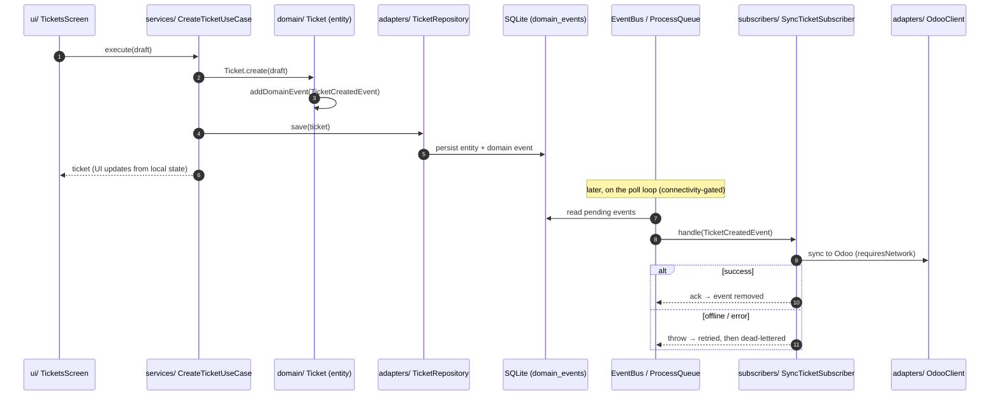

# Consumer Architecture — how to structure an app on `@sincpro/mobile`

> This is the **recommended shape** for a business app built on the framework.
> The framework gives you the runtime (queues, events, cron, DB, telemetry, UI kit);
> your job is to fill four layers — **adapters, services, ui, subscribers** — and
> wire them with a `DomainModule`. Everything below is convention, not magic: it
> exists so an app stays testable, swappable, and navigable as it grows.

---

## 1. Mental model — hexagonal, one bounded context per module

The framework owns the **center** (orchestrator, kernel, event bus, DB, telemetry).
Your app plugs into it as a `DomainModule` and provides the **edges**.

```mermaid
flowchart TB
    subgraph APP["Your app (a DomainModule)"]
        direction TB
        ui["ui/<br/>screens — render only,<br/>uses @sincpro/mobile-ui"]
        svc["services/<br/>use cases · workflows<br/>(business logic)"]
        subs["subscribers/<br/>react to domain events<br/>(decoupled side effects)"]
        adp["adapters/<br/>external services + repositories<br/>(implement ports)"]
        dom["domain/<br/>entities · value objects · events · port interfaces"]
    end

    subgraph FW["@sincpro/mobile (framework runtime)"]
        kernel["Orchestrator / Kernel"]
        bus["EventBus / ProcessQueue"]
        db["DBCursor + migrations (SQLite)"]
        tel["Tracing / telemetry"]
    end

    uikit[["@sincpro/mobile-ui<br/>design system"]]
    ext[["External systems<br/>(Odoo / REST / BLE printer)"]]

    ui --> svc
    ui -.->|components| uikit
    svc --> dom
    svc --> adp
    adp -->|implements ports from| dom
    adp -->|SQLite via| db
    adp -->|HTTP/BLE| ext
    dom -->|addDomainEvent| bus
    bus --> subs
    subs --> svc
    kernel -->|wires module hooks| APP
    svc -.->|@TraceClass / @Trace| tel
```

**The one rule:** dependencies point **inward**. `ui` → `services` → `domain`;
`adapters` implement interfaces declared in `domain`. `domain` imports nothing
outward. This is what lets you unit-test a use case with a fake repository and swap
the Odoo adapter for a REST one without touching business logic.

---

## 2. Folder layout

```
sincpro_mobile_myapp/
├── app/
│   └── index.tsx                ← calls createMyApp(), exports default
└── sincpro_mobile_myapp/
    ├── entrypoints/
    │   └── main.tsx             ← DomainModule class + createMyApp()
    ├── domain/                  ← entities, value objects, domain events, PORT interfaces
    │   ├── ticket.entity.ts
    │   ├── events.ts            ← TicketCreatedEvent, SyncTicketEvent (extend DomainEvent)
    │   └── ports.ts             ← ITicketRepository, IOdooClient (interfaces only)
    ├── adapters/
    │   ├── repositories/        ← ITicketRepository impl (SQLite via DBCursor + mapped)
    │   └── external/            ← OdooClient / ApiClient impl (HTTP), PrinterAdapter (BLE)
    ├── services/
    │   ├── use_cases/           ← CreateTicket, CloseTicket (one transaction each)
    │   └── workflows/           ← SyncDayWorkflow (multi-step, @TraceClass)
    ├── subscribers/             ← TicketCreatedSubscriber, SyncTicketSubscriber
    └── ui/
        ├── screens/             ← TicketsScreen (composes mobile-ui)
        └── theme/tokens.ts
```

---

## 3. The four layers

### `adapters/` — external services & repositories (implement ports)

Adapters are the only place that knows about the outside world (SQLite, HTTP, BLE).
They **implement interfaces declared in `domain/`**, so the rest of the app depends on
the interface, not the implementation.

```ts
// domain/ports.ts — the contract (no implementation)
export interface ITicketRepository {
  save(ticket: Ticket): Promise<void>;
  findPending(): Promise<Ticket[]>;
}

// adapters/repositories/ticket.repository.ts — SQLite implementation
import { DBCursor } from "@sincpro/mobile/infrastructure/database";

export class TicketRepository implements ITicketRepository {
  async save(ticket: Ticket): Promise<void> {
    await DBCursor.mutateDatabase(
      `INSERT INTO tickets (id, status, payload) VALUES (?, ?, ?)`,
      ticket.id,
      ticket.status,
      JSON.stringify(ticket.toJSON()),
    );
  }
  async findPending(): Promise<Ticket[]> {
    /* getAllAsync + map rows → entities */
  }
}

// adapters/external/odoo.client.ts — HTTP implementation of an outbound port
export class OdooClient implements IOdooClient {
  /* fetch(...) */
}
```

**Why ports/adapters:** swap SQLite↔remote or Odoo↔REST without touching use cases;
unit-test business logic with an in-memory fake. The framework's own `DBCursor`,
`mapped`/`resolveEntity` helpers live under `@sincpro/mobile/infrastructure/database`.

### `services/` — use cases & workflows (business logic)

A **use case** is one business transaction: load entities via repositories, run domain
logic, persist, and let entities emit domain events. A **workflow** orchestrates several
steps (often across screens or with retries) — decorate it with `@TraceClass` for a span
per step.

```ts
// services/use_cases/create_ticket.use_case.ts
export class CreateTicketUseCase {
  constructor(private readonly tickets: ITicketRepository) {}

  async execute(input: CreateTicketInput): Promise<Ticket> {
    const ticket = Ticket.create(input); // domain logic + ticket.addDomainEvent(new TicketCreatedEvent(...))
    await this.tickets.save(ticket); // persists; the event lands in domain_events
    return ticket;
  }
}

// services/workflows/sync_day.workflow.ts
@Tracing.TraceClass("sync")
export class SyncDayWorkflow {
  async run() {
    /* multi-step; each method = a child span, context propagated */
  }
}
```

**Why a thin use-case layer:** it's the seam the UI and subscribers both call, the unit
of a transaction, and the natural place to attach tracing. Keep it free of React and of
SQL — it speaks domain + ports only.

### `ui/` — screens (render only)

Screens compose `@sincpro/mobile-ui` components and call use cases. **No business logic,
no SQL, no fetch** in the UI — it reads state and dispatches intents.

```tsx
import { Screen, Button, ListItem } from "@sincpro/mobile-ui";

export function TicketsScreen() {
  const onCreate = () => createTicketUseCase.execute(draft); // delegate to a service
  return (
    <Screen>
      {pending.map((t) => (
        <ListItem key={t.id} title={t.code} />
      ))}
      <Button onPress={onCreate}>New ticket</Button>
    </Screen>
  );
}
```

The screen is registered against the module key in the app shell `ui` map
(`{ [ticketsModule.key]: TicketsScreen }`).

### `subscribers/` — decoupled side effects

A **subscriber** reacts to a domain event _after_ the transaction committed it. This is
how you decouple side effects (print, sync, notify) from the use case that triggered them.
Events with `requiresNetwork = true` are held by the queue until connectivity returns.

```ts
// subscribers/sync_ticket.subscriber.ts
export const SyncTicketSubscriber: Subscriber = {
  event: SyncTicketEvent.name,
  async handle(event) {
    await syncDayWorkflow.run(); // runs offline-safe; retried via the queue on failure
  },
};
```

You never call the EventBus directly — you **declare** subscribers and the framework
dispatches. Failures are retried and dead-lettered automatically.

---

## 4. Wiring — the `DomainModule` ties the layers together

The module is the single registration point. The framework reads its hooks during boot
(repositories → migrations → subscribers → crons) and starts the workers.

```ts
export class TicketsModule extends DomainModule {
  readonly key = "TICKETS";
  readonly name = "Tickets";

  override repositories() {
    return { ticketRepo: new TicketRepository() };
  }
  override migrations() {
    return [CreateTicketsTable];
  }
  override subscribers() {
    return [TicketCreatedSubscriber, SyncTicketSubscriber];
  }
  override crons() {
    return [SyncPendingTicketsCron];
  }
  override persistOnReset() {
    return ["ticket_templates"];
  } // survive logout wipe
}
```

---

## 5. Sequence — a typical request, end to end

Shows the layers cooperating: UI dispatches an intent, a use case runs domain logic and
persists, the entity's domain event is queued, and a subscriber performs the side effect
later (and offline-safely).



**Why this shape:** the UI returns immediately from local state (offline-first); the side
effect (Odoo sync) is decoupled, retried, and survives app restarts because the event was
persisted before processing. The use case stayed pure and testable; the network detail
lives in one adapter.

---

## 6. Checklist for a new feature

1. **Domain** — model the entity + the events it emits + the port interfaces it needs.
2. **Adapters** — implement the repository (SQLite) and any external client (HTTP/BLE).
3. **Services** — write the use case (one transaction); add a workflow if multi-step.
4. **UI** — a screen that calls the use case, built from `@sincpro/mobile-ui`.
5. **Subscribers** — for each side effect, declare a subscriber on the relevant event.
6. **Module** — register repositories/migrations/subscribers/crons; add the screen to the `ui` map.
7. **(Optional) Telemetry** — `@Tracing.TraceClass` on workflows/use cases; correlate logs with `Tracing.logSuffix()`.
