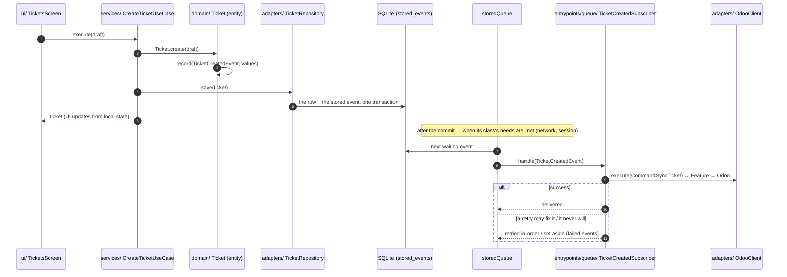

# Consumer Architecture — how to structure an app on `@sincpro/mobile`

> This is the **recommended shape** for a business app built on the framework.
> The framework gives you the runtime (queues, events, cron, DB, telemetry, UI kit);
> your job is to fill four layers — **adapters, services, ui, subscribers** — and
> wire them with a `DomainModule`. Everything below is convention, not magic: it
> exists so an app stays testable, swappable, and navigable as it grows.

---

## 1. Mental model — hexagonal, one bounded context per module

The framework owns the **center** (orchestrator, kernel, event bus, DB, telemetry).
Your app plugs into it as a `DomainModule` and provides the **edges**.

```mermaid
flowchart TB
    subgraph APP["Your app (a DomainModule)"]
        direction TB
        ui["ui/<br/>screens — render only,<br/>uses @sincpro/mobile-ui"]
        svc["services/<br/>use cases · workflows<br/>(business logic)"]
        subs["entrypoints/queue/<br/>EventSubscribers: an event → its Command<br/>(decoupled side effects)"]
        adp["adapters/<br/>external services + repositories<br/>(implement ports)"]
        dom["domain/<br/>entities · value objects · events · port interfaces"]
    end

    subgraph FW["@sincpro/mobile (framework runtime)"]
        kernel["Orchestrator / Kernel"]
        bus["storedQueue (client-framework) · eventDelivery"]
        db["DBCursor + migrations (SQLite)"]
        tel["Tracing / telemetry"]
    end

    uikit[["@sincpro/mobile-ui<br/>design system"]]
    ext[["External systems<br/>(Odoo / REST / BLE printer)"]]

    ui --> svc
    ui -.->|components| uikit
    svc --> dom
    svc --> adp
    adp -->|implements ports from| dom
    adp -->|SQLite via| db
    adp -->|HTTP/BLE| ext
    dom -->|record → stored with the save| bus
    bus --> subs
    subs --> svc
    kernel -->|wires module hooks| APP
    svc -.->|@TraceClass / @Trace| tel
```

**The one rule:** dependencies point **inward**. `ui` → `services` → `domain`;
`adapters` implement interfaces declared in `domain`. `domain` imports nothing
outward. This is what lets you unit-test a use case with a fake repository and swap
the Odoo adapter for a REST one without touching business logic.

---

## 2. Folder layout

```
sincpro_mobile_myapp/
├── app/
│   └── index.tsx                ← calls createMyApp(), exports default
└── sincpro_mobile_myapp/
    ├── entrypoints/
    │   ├── main.tsx             ← DomainModule class + createMyApp()
    │   ├── queue/               ← EventSubscribers + ticketsSubscriptions (index.ts)
    │   └── cron/                ← CronWorkers whose jobs execute a Command
    ├── domain/                  ← entities, value objects, domain events, PORT interfaces
    │   ├── ticket.entity.ts
    │   ├── events.ts            ← TicketCreatedEvent, SyncTicketEvent (extend DomainEvent)
    │   └── ports.ts             ← ITicketRepository, IOdooClient (interfaces only)
    ├── adapters/
    │   ├── repositories/        ← ITicketRepository impl (SQLite via DBCursor + mapped)
    │   └── external/            ← OdooClient / ApiClient impl (HTTP), PrinterAdapter (BLE)
    ├── services/
    │   └── ticket/              ← one folder per aggregate: Features, ApplicationServices
    │       └── lines/           ← an entity of the aggregate with use cases of its own
    ├── infrastructure/
    │   └── bounded_context.ts   ← ticketsBoundedContext: dependencies + registrations
    └── ui/
        ├── screens/             ← TicketsScreen (composes mobile-ui)
        └── theme/tokens.ts
```

---

## 3. The four layers

### `adapters/` — external services & repositories (implement ports)

Adapters are the only place that knows about the outside world (SQLite, HTTP, BLE).
They **implement interfaces declared in `domain/`**, so the rest of the app depends on
the interface, not the implementation.

```ts
// domain/ports.ts — the contract (no implementation)
export interface ITicketRepository {
  save(ticket: Ticket): Promise<void>;
  findPending(): Promise<Ticket[]>;
}

// adapters/repositories/ticket.repository.ts — SQLite implementation
import { DBCursor } from "@sincpro/mobile/infrastructure/database";

export class TicketRepository implements ITicketRepository {
  async save(ticket: Ticket): Promise<void> {
    await DBCursor.mutateDatabase(
      `INSERT INTO tickets (id, status, payload) VALUES (?, ?, ?)`,
      ticket.id,
      ticket.status,
      JSON.stringify(ticket.toJSON()),
    );
  }
  async findPending(): Promise<Ticket[]> {
    /* getAllAsync + map rows → entities */
  }
}

// adapters/external/odoo.client.ts — HTTP implementation of an outbound port
export class OdooClient implements IOdooClient {
  /* fetch(...) */
}
```

**Why ports/adapters:** swap SQLite↔remote or Odoo↔REST without touching use cases;
unit-test business logic with an in-memory fake. The framework's own `DBCursor`,
`mapped`/`resolveEntity` helpers live under `@sincpro/mobile/infrastructure/database`.

### `services/` — use cases & workflows (business logic)

A **use case** is one business transaction: load entities via repositories, run domain
logic, persist, and let entities emit domain events. It is a `Feature` of
`@sincpro/client-framework`, registered for its `Command` in the module's bounded context. A
**workflow** — several use cases with decisions between them — is an `ApplicationService` that
composes Features through `this.featureBus`. Every run is a span (`<context>/<serviceName>`),
logs through `this.logger` and is reported once when it fails unexpectedly; nothing else opens
spans.

```ts
import {
  ApplicationService,
  BoundedContext,
  Command,
  Feature,
} from "@sincpro/client-framework";

export class CommandCreateTicket extends Command<Ticket> {
  constructor(readonly input: CreateTicketInput) {
    super();
  }
}

export class CreateTicket extends Feature<CommandCreateTicket, Ticket> {
  static readonly serviceName = "CreateTicket";
  declare readonly tickets: ITicketRepository;
  async execute(command: CommandCreateTicket): Promise<Ticket> {
    const ticket = Ticket.create(command.input);
    await this.tickets.save(ticket);
    return ticket;
  }
}

export class SyncDay extends ApplicationService<CommandSyncDay, void> {
  static readonly serviceName = "SyncDay";
  async execute(command: CommandSyncDay): Promise<void> {
    await this.featureBus.execute(new CommandCreateTicket(command.input)); // child span
  }
}

export const ticketsBoundedContext = new BoundedContext<{ tickets: ITicketRepository }>(
  "tickets",
);
ticketsBoundedContext.addDependency("tickets", tickets);
ticketsBoundedContext.feature(CommandCreateTicket)(CreateTicket);
ticketsBoundedContext.appService(CommandSyncDay)(SyncDay);

await ticketsBoundedContext.execute(new CommandCreateTicket(input)); // from a screen
```

Services live in one folder per aggregate (`services/ticket/`); an entity of that aggregate with
use cases of its own gets a folder inside it (`services/sale_order/payments/`). A bounded
context is named for what it is — `ticketsBoundedContext`, never `ctx`.

**Why a thin use-case layer:** it's the seam the UI, the subscribers and the crons all call —
they are entrypoints that build a Command and execute it —, the unit of a transaction, and where
tracing, logging and error reporting happen. Keep it free of React and of SQL — it speaks
domain + ports only.

### `ui/` — screens (render only)

Screens compose `@sincpro/mobile-ui` components and call use cases. **No business logic,
no SQL, no fetch** in the UI — it reads state and dispatches intents.

```tsx
import { Screen, Button, ListItem } from "@sincpro/mobile-ui";

export function TicketsScreen() {
  const onCreate = () => createTicketUseCase.execute(draft); // delegate to a service
  return (
    <Screen>
      {pending.map((t) => (
        <ListItem key={t.id} title={t.code} />
      ))}
      <Button onPress={onCreate}>New ticket</Button>
    </Screen>
  );
}
```

The screen is registered against the module key in the app shell `ui` map
(`{ [ticketsModule.key]: TicketsScreen }`).

### `entrypoints/queue/` — subscribers, the doors of events

A **subscriber** is an entrypoint, like a screen or a cron: it hears one event _after_ the
transaction stored it and executes a Command on the module's bounded context. The work — and
any decision — is the Feature or ApplicationService that Command reaches. Whether the event
may go now (a connection, a session) is declared by the **event's class**.

```ts
// domain/events.ts
export class TicketClosedEvent extends DomainEvent {
  static readonly eventName = "tickets.ticket.v1.closed";
  static readonly label = "Ticket cerrado";
  static readonly requiresNetwork = true; // waits for a connection
  ticketId = "";
}

// entrypoints/queue/ticket_closed.subscriber.ts
export class TicketClosedSubscriber extends EventSubscriber<TicketClosedEvent> {
  static readonly subscriberName = "TicketClosed";
  declare readonly ticketsBoundedContext: BoundedContext<TicketsDependencies>;
  async handle(event: TicketClosedEvent) {
    await this.ticketsBoundedContext.execute(new CommandSyncTicket(event.ticketId));
  }
}

// entrypoints/queue/index.ts
export const ticketsSubscriptions = new Subscriptions<TicketsEntrypoints>(
  "tickets-subscriptions",
);
ticketsSubscriptions.addDependency("ticketsBoundedContext", ticketsBoundedContext);
ticketsSubscriptions.subscribe(TicketClosedEvent)(TicketClosedSubscriber);
```

You never publish to deliver a result: a caller that needs the answer executes the use case
(`ticketsBoundedContext.execute(...)`). The queue retries what a retry may fix and sets aside
what never will — the failed events a person retries.

---

## 4. Wiring — the `DomainModule` ties the layers together

The module is the single registration point. The framework reads its hooks during boot
(repositories → migrations → bounded contexts and subscriptions → crons); while its domain is
active, they hear the stored queue.

```ts
export class TicketsModule extends DomainModule {
  readonly key = "TICKETS";
  readonly name = "Tickets";

  override repositories() {
    return { ticketRepo: new TicketRepository() };
  }
  override migrations() {
    return [CreateTicketsTable];
  }
  override boundedContexts() {
    return [ticketsBoundedContext];
  }
  override subscribers() {
    return [ticketsSubscriptions];
  }
  override crons() {
    return [SyncPendingTicketsCron];
  }
  override persistOnReset() {
    return ["ticket_templates"];
  } // survive logout wipe
}
```

---

## 5. Sequence — a typical request, end to end

Shows the layers cooperating: UI dispatches an intent, a use case runs domain logic and
persists, the entity's domain event is queued, and a subscriber performs the side effect
later (and offline-safely).


```mermaid
sequenceDiagram
    autonumber
    participant UI as ui/ TicketsScreen
    participant UC as services/ CreateTicketUseCase
    participant E as domain/ Ticket (entity)
    participant Repo as adapters/ TicketRepository
    participant DB as SQLite (stored_events)
    participant Bus as storedQueue
    participant Sub as entrypoints/queue/ TicketCreatedSubscriber
    participant Ext as adapters/ OdooClient

    UI->>UC: execute(draft)
    UC->>E: Ticket.create(draft)
    E->>E: record(TicketCreatedEvent, values)
    UC->>Repo: save(ticket)
    Repo->>DB: the row + the stored event, one transaction
    UC-->>UI: ticket (UI updates from local state)
    Note over Bus: after the commit — when its class's needs are met (network, session)
    Bus->>DB: next waiting event
    Bus->>Sub: handle(TicketCreatedEvent)
    Sub->>Ext: execute(CommandSyncTicket) → Feature → Odoo
    alt success
        Sub-->>Bus: delivered
    else a retry may fix it / it never will
        Sub-->>Bus: retried in order / set aside (failed events)
    end
```

**Why this shape:** the UI returns immediately from local state (offline-first); the side
effect (Odoo sync) is decoupled, retried, and survives app restarts because the event was
persisted before processing. The use case stayed pure and testable; the network detail
lives in one adapter.

---

## 6. Checklist for a new feature

1. **Domain** — model the entity + the events it emits + the port interfaces it needs.
2. **Adapters** — implement the repository (SQLite) and any external client (HTTP/BLE).
3. **Services** — write the use case (one transaction); add a workflow if multi-step.
4. **UI** — a screen that calls the use case, built from `@sincpro/mobile-ui`.
5. **Subscribers** — for each side effect, an `EventSubscriber` in `entrypoints/queue` that executes its Command; readiness on the event's class.
6. **Module** — register repositories, migrations, `boundedContexts()`, `subscribers()` (the `Subscriptions`) and crons.
7. **Telemetry** — every `Feature` / `ApplicationService` run already opens its span (`createKernel` configures the process). Shipping it is still opt-in: `createApp({ telemetry })` with an `otlp` endpoint. `@Tracing.TraceClass` remains for a class that is not a use case.
