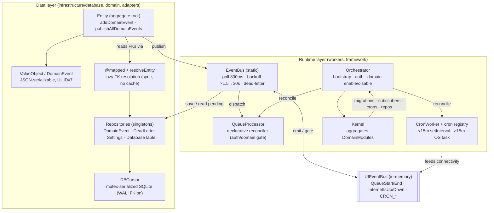
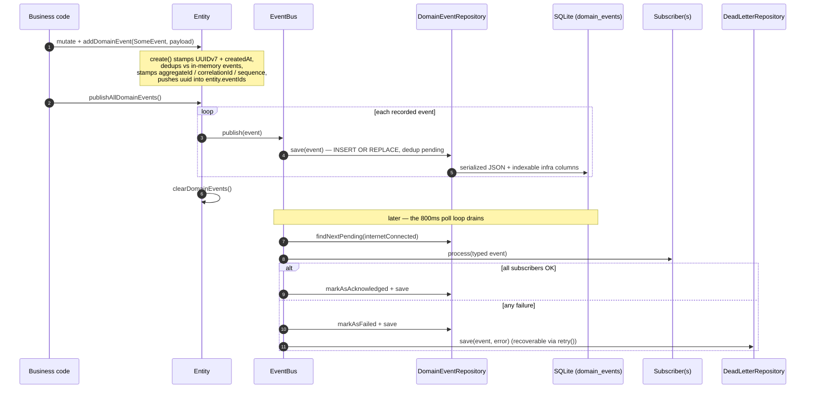
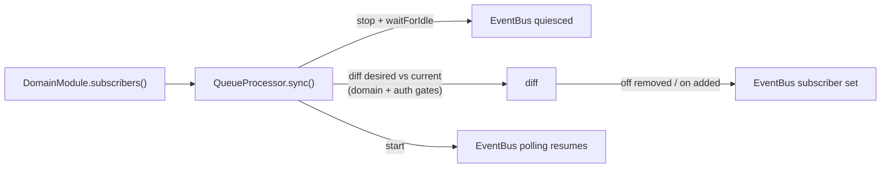
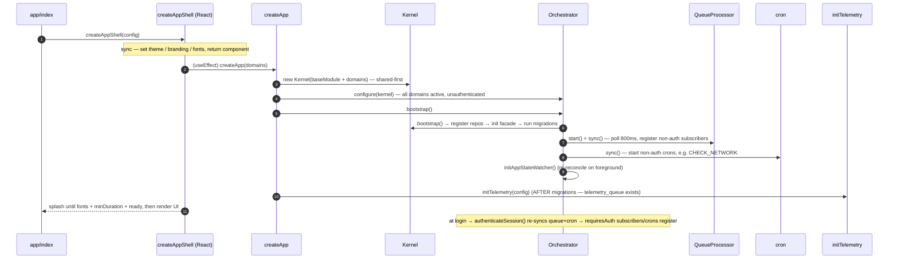

# Core Architecture

> The framework's center: how data is stored (an "almost-ORM" over SQLite), how
> domain state changes are captured (event-sourced entities), how those changes
> are processed (a persistent event bus + a declarative reconciler), how recurring
> work runs (cron), and how it all boots (AppShell → Orchestrator → Kernel).
> This doc explains the components, the runtime sequences, and **why** each call was made.

---

## 1. The big picture — two buses, one persistent queue

The single most important thing to understand: there are **two event systems**, and they
do different jobs.

|              | `EventBus` (domain)                                            | `UIEventBus` (UI signals)                                                   |
| ------------ | -------------------------------------------------------------- | --------------------------------------------------------------------------- |
| Backing      | **SQLite** (`domain_events` table) — survives restarts         | In-memory (`mitt`) — ephemeral                                              |
| Carries      | Business domain events (durable, at-least-once, dead-lettered) | UI/runtime signals: `QueueStart/End`, `InternetIsUp/Down`, `CRON_START/END` |
| Failure mode | Retry → dead-letter queue                                      | Fire-and-forget, 300 ms debounce                                            |

The `EventBus` **emits to** and **listens from** the `UIEventBus` (e.g. it flips offline
on a `DomainNetworkError` and gates draining on `InternetIsUp/Down`). Business-critical
data lives only in the `EventBus`/SQLite path — never in telemetry or UI signals.



---

## 2. The "almost-ORM" — `DBCursor` + `@mapped`

There is **no ORM**. There's a thin, deliberate seam over `expo-sqlite`.

**`DBCursor`** (`infrastructure/database/connector.ts`) — a small object exposing
`mutateDatabase` / `getFirstAsync` / `getAllAsync` / `execAsync` (async, **serialized by an
`async-mutex`**) plus sync variants (`getFirstSync` / `getAllSync`, **not** mutex-guarded).
Every connection opens with `PRAGMA journal_mode = WAL` and `foreign_keys = ON`. Query
logging skips the queue/telemetry tables to avoid a write-amplification loop (a failing
log insert that logs an error that tries to insert again).

**`@mapped` + `resolveEntity`** (`infrastructure/database/mapped.ts`) — a property decorator
that turns a stored foreign-key column into a live entity reference:

```ts
class Ticket extends Entity {
  lineIds: string[] = [];
  @mapped(ECommonRepository.TICKET_LINE, "lineIds")
  get lines(): TicketLine[] {
    return undefined as never;
  } // body replaced by the decorator
}
```

Reading `ticket.lines` synchronously queries SQLite by `lineIds` and rehydrates the rows
into entities — **every access, no caching**.

| Decision                                       | Why                                                                                                                                                           |
| ---------------------------------------------- | ------------------------------------------------------------------------------------------------------------------------------------------------------------- |
| Async path serialized by a single Mutex        | SQLite is single-writer; the mutex prevents interleaved writes/corruption across the app's concurrent flows                                                   |
| `@mapped` never caches (always re-queries)     | Always-fresh data, zero stale-cache bugs, no memory overhead — at the cost of a sync main-thread read (documented limitation: scalar/array FK only, no joins) |
| Repository facade injected lazily at bootstrap | Breaks the circular import between entities (need repos) and repos (need entities)                                                                            |
| UUID **v7** for ids                            | Time-ordered, so ordering events by `created_at`/`sequence` is stable                                                                                         |

---

## 3. Entity model + event sourcing

An **`Entity`** is the event-sourced aggregate root (`domain/entity/entity.ts`, extends
`ValueObject`). State changes are captured as **`DomainEvent`s** rather than applied silently.

Lifecycle of a change:



`DomainEvent` carries business identity (`name`, `label`, `requiresNetwork`), lifecycle
(`status` ∈ PENDING/PROCESSING/ACKNOWLEDGED/FAILED/CANCELLED, `attempts`), and correlation
(`aggregateId`, `correlationId`, `sequence`). Callers may only set **business** fields —
infra fields are stamped by the framework. Reads of `entity.events` resolve live from
`domain_events` via `@mapped`.

**Why event-sourced entities:** the change is persisted _before_ it's processed (offline-first
— survives restart), side effects are decoupled from the transaction (subscribers), and
correlation/sequence give you an ordered, queryable audit trail for free.

---

## 4. Default repositories

There is **no base repository class**. Each is a hand-written `…Impl` exported as a
**singleton**, structurally satisfying the `IRepository` / `IRemoteRepository` interfaces
(`domain/database/repository.ts`) and hitting SQLite only through `DBCursor`.

| Repository                        | Table                       | Role                                                                                                                                              |
| --------------------------------- | --------------------------- | ------------------------------------------------------------------------------------------------------------------------------------------------- |
| `DomainEventRepository`           | `domain_events`             | Backs the event queue: `save` (dedup pending), `findNextPending(online)`, `findByStatus/Correlation/Aggregate`, sync `findByIdSync` for `@mapped` |
| `DomainEventDeadLetterRepository` | `domain_events_dead_letter` | Permanently-failed events; `retry(uuid)` / `retryByCorrelationId` move them back to PENDING                                                       |
| `SettingsRepository`              | `settings`                  | Typed key/value store (`JSON.stringify` + `type` column)                                                                                          |
| `DatabaseTableRepository`         | `sqlite_master`             | Introspection only (list tables, dump rows)                                                                                                       |

`findNextPending(internetConnected)` is the connectivity gate: when offline the SQL appends
`AND requires_network = 0`, so only local events drain — network events stay PENDING.

---

## 5. EventBus + QueueProcessor — persistent processing, declared not imperative

**`EventBus`** (static, `infrastructure/workers/EventBus.ts`) polls `domain_events` every
**800 ms**, draining until empty. On failure it backs off `min(800 × 1.5^failures, 30000)` ms.
A `DomainNetworkError` flips it offline and emits `InternetIsDownEvent`; `InternetIsUp` resets
it to 800 ms and resumes. Each event runs all matching subscribers; success → acknowledged,
failure → dead-lettered.

> **Caveat worth knowing:** `MAX_ATTEMPTS = 1`. A subscriber that throws (including on a
> transient `DomainNetworkError`) is dead-lettered rather than retried in place — recovery
> is via `DeadLetterRepository.retry()`. Connectivity gating prevents network events from
> _starting_ while offline, but an in-flight network failure dead-letters.

**`QueueProcessor`** (`entrypoints/queue/QueueProcessor.ts`) is a **declarative reconciler**
in front of the imperative bus. You never call `EventBus.on/off` directly — you declare
subscribers on a `DomainModule`, and `sync(activeDomains, isAuthenticated, subscribersByKey)`
diffs desired-vs-current and registers/unregisters accordingly. Two gates:

- **Domain gate** — only active domains' subscribers run.
- **Auth gate** — a subscriber with `requiresAuth` (default `true`) runs only once authenticated.



**Why a reconciler:** domains can be enabled/disabled and sessions can log in/out at runtime;
expressing the subscriber set as a pure function of `(domains, auth)` makes those transitions
idempotent and race-free (it quiesces the bus, diffs, then restarts).

---

## 6. Cron — the 15-minute split

**`CronWorker`** (`infrastructure/workers/CronWorker.ts`) hides a platform reality behind one
constructor (`taskName`, `job`, `intervalMin = 15`, `requiresAuth`):

- **`intervalMin < 15`** → JS `setInterval` (foreground, fires immediately + on interval).
- **`intervalMin ≥ 15`** → real OS background task via `expo-background-task` + `expo-task-manager`
  (15 min is the OS floor for background scheduling on iOS/Android).

The **`cron`** registry mirrors `QueueProcessor`: `cron.sync(domains, auth, cronsByKey)` reconciles
the running cron set, with the same domain + auth gates, calling `waitForIdle()` before
unregistering. Example: `CHECK_NETWORK` runs every 2.5 min (setInterval path, no auth) and
feeds the `InternetIsUp/Down` signals that gate the EventBus and the telemetry flush.

---

## 7. Composition & boot — AppShell → Orchestrator → Kernel

- **`DomainModule`** — a bounded context. Hooks: `repositories()`, `migrations()`,
  `subscribers()`, `crons()`, `persistOnReset()`. `shared` modules sort first and can't be disabled.
- **`BaseModule`** (`key="COMMON"`, `shared`) — always on; provides the base repositories,
  migrations, the system subscribers, and `CHECK_NETWORK`. It marks `telemetry_queue` + `spans_queue`
  as `persistOnReset` so telemetry generated during logout still ships.
- **`Kernel`** — aggregates modules (shared-first), merges their hooks, runs migrations,
  and `restartDatabase()` (drops all but `persistOnReset` tables on logout-with-wipe).
- **`Orchestrator`** — the runtime brain: `bootstrap()`, `authenticateSession()`, runtime
  `enableDomain/disableDomain` (mutex-serialized), and an AppState watcher that re-reconciles
  queue + cron whenever the app foregrounds.



**Why telemetry inits last:** migrations must have created `telemetry_queue`/`spans_queue`
first, or the first buffered span/log would fail.

---

## 8. Consolidated design rationale

| Decision                                             | Rationale                                                                                                                                                                                     |
| ---------------------------------------------------- | --------------------------------------------------------------------------------------------------------------------------------------------------------------------------------------------- |
| Two buses (durable EventBus vs ephemeral UIEventBus) | Business data must survive restarts and be retried/dead-lettered; UI signals must be cheap and disposable. Conflating them would either make UI signals expensive or make domain events lossy |
| Persist domain event before processing               | Offline-first: the change survives a crash/restart and processes on recovery                                                                                                                  |
| Subscribers, not inline side effects                 | Decouples side effects (print, sync) from the transaction; failures retry/dead-letter independently                                                                                           |
| Declarative reconcilers (QueueProcessor / cron)      | Runtime domain + auth transitions become idempotent pure functions of state, not imperative wiring                                                                                            |
| Mutex-serialized DBCursor                            | One writer; prevents interleaved-write corruption across concurrent flows                                                                                                                     |
| `@mapped` sync + no cache                            | Always-fresh reads, no stale-cache class of bugs; accepted main-thread cost for simple FK lookups                                                                                             |
| `MAX_ATTEMPTS = 1` + dead-letter                     | Bounded, predictable failure handling; recovery is explicit via `retry()`. (Trade-off: transient failures dead-letter rather than auto-retry in place)                                        |
| `persistOnReset` for telemetry tables                | Telemetry produced during logout must still be delivered; the flush is auth-independent                                                                                                       |
