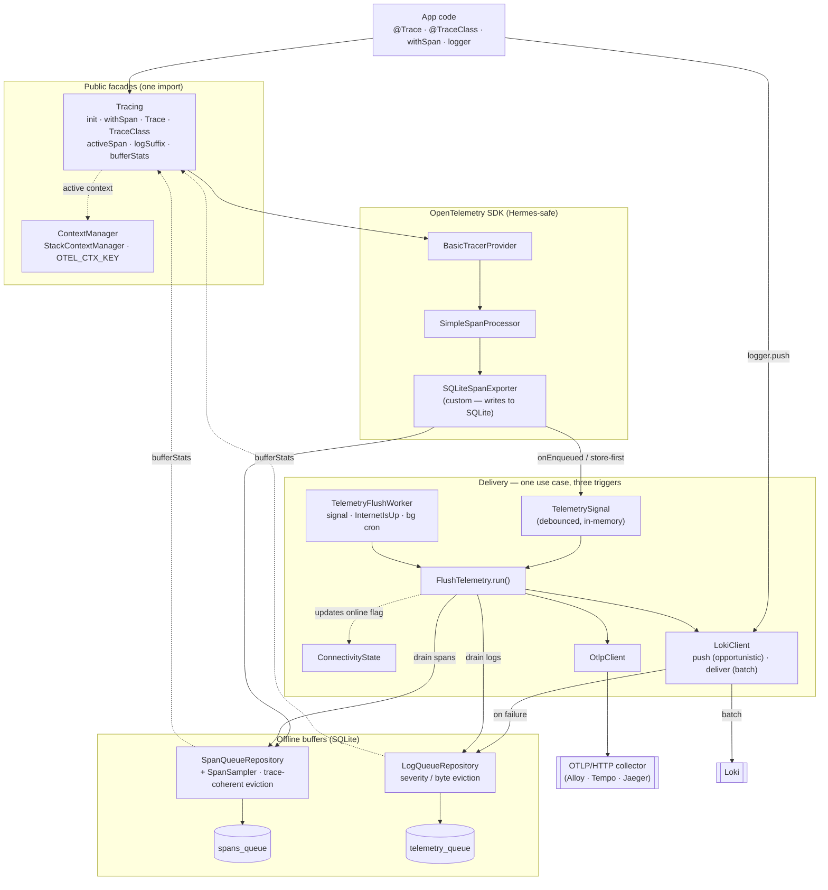
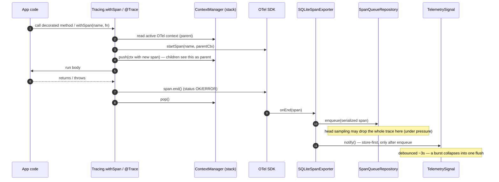
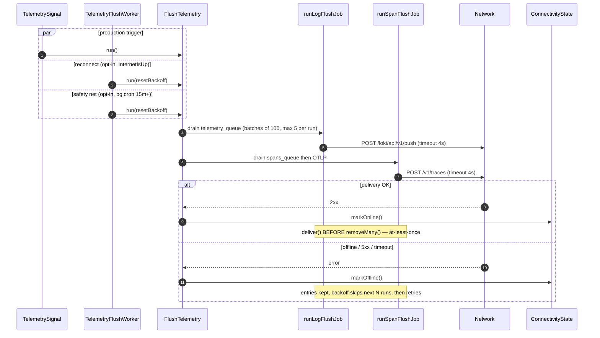
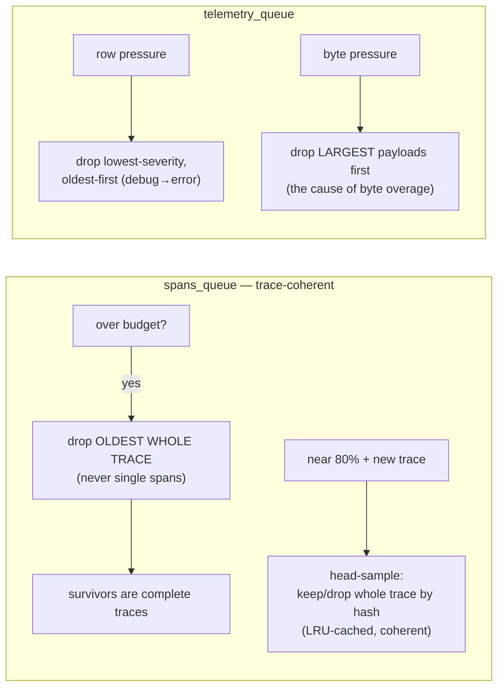

# Telemetry Architecture

> Distributed tracing + structured logs, **offline-first**, on the OpenTelemetry SDK.
> Spans buffer to SQLite and ship to any OTLP/HTTP collector; logs ship to Loki.
> Telemetry is **opt-in**, **best-effort**, and **bounded** — it must never block the
> UI thread, depend on the host app's connectivity cron, or lose business data.

This document explains the components, the runtime sequences, and **why** each
decision was made. For the public API and a quick overview, see the README.

---

## 1. Design goals (the "why" up front)

| Goal                                | Consequence in the design                                                                |
| ----------------------------------- | ---------------------------------------------------------------------------------------- |
| Works on an offline device for days | SQLite buffers, bounded by rows **and** bytes, with intelligent eviction                 |
| Never blocks the UI thread          | Fire-and-forget ingest; delivery on a debounced signal; hard `fetch` timeout             |
| No hard dependency on app infra     | Delivery self-heals via job backoff; connectivity events & cron are _optional_ triggers  |
| Never lose business data            | Telemetry is explicitly best-effort; business data uses the durable `domain_events` path |
| One import, hard to misuse          | Two facades: `Tracing` and `ContextManager`                                              |
| Don't reinvent standards            | Official OTel SDK for spans/context/serialization; only `SQLiteSpanExporter` is custom   |

---

## 2. Component diagram



**Layering note.** Telemetry depends on `ContextManager` one-directionally — nothing
in the context manager imports telemetry, so there is no cycle. `initTelemetry` lives
in its own module (not the barrel) to keep `Tracing` ⇄ `index` import-cycle-free.

---

## 3. Sequence — producing a span (store-first)

Why **store-first**: persisting before attempting delivery means a crash mid-send
never loses the span, and spans ship in efficient batches instead of one HTTP call each.



---

## 4. Sequence — delivery (online) & offline recovery

A single `FlushTelemetry.run()` drains **both** queues. Three triggers funnel into it;
none is required. Recovery rides the jobs' own exponential backoff, so the pipeline
self-heals when the network returns even with **no cron and no connectivity events**.



**At-least-once, not exactly-once.** `deliver()` always precedes `removeMany()`. A crash
between them re-sends the same batch next run. Duplicates are acceptable for telemetry;
data loss is not. Backoff: skip `min(2^(failures-1), 32)` runs, reset to 0 on success.

---

## 5. Retention — bounded, coherent, observable

Telemetry **cannot** buffer forever. The job is to lose data _intelligently and visibly_,
never silently. Both buffers are capped by **row count AND payload bytes** (predictable
storage regardless of attribute size). The eviction check is **amortized** (once every N
enqueues) so the hot path stays cheap; the bound is soft (may transiently exceed by ≤N rows).



| Policy                                        | Why                                                                                                                                                                                       |
| --------------------------------------------- | ----------------------------------------------------------------------------------------------------------------------------------------------------------------------------------------- |
| Spans evict **whole traces**                  | FIFO-by-row evicts roots first → orphaned children → broken traces downstream                                                                                                             |
| Spans **head-sample** under pressure          | Stop thrashing insert→evict; keep a _coherent sample_ (per-trace decision, hash-deterministic, LRU-cached so a mid-trace pressure flip can't split a trace)                               |
| Logs evict **by severity** (count pressure)   | A flood of `debug`/`info` must not push out `error`/`warn`                                                                                                                                |
| Logs evict **largest-first** (byte pressure)  | The oversized payload IS the byte problem; shedding it keeps the most entries. (Corollary: keep big blobs out of logs — a huge high-severity payload is not protected from byte eviction) |
| `bufferStats()` exposes `dropped` + `sampled` | A rising backlog is a dashboard signal, not a silent gap. `dropped` = evicted after buffering (back-pressure); `sampled` = refused at ingest (load shed)                                  |

---

## 6. Why a stack-based context manager

Hermes (React Native's engine) has **no `AsyncLocalStorage`**, so the framework carries
the active OpenTelemetry context in an explicit push/pop stack (`StackContextManager`,
keyed by `OTEL_CTX_KEY`). A span created inside a `withSpan`/`@Trace` body sees the
enclosing span as its parent because that context sits on top of the stack.

Trade-off: concurrent `Promise.all` branches share the top of stack. This is documented
and acceptable for the sequential flows mobile apps actually run. `@TraceClass` composes
`interceptClass` + `tracingHooks` + `PropagateContext` so context survives across method
calls and async hand-offs on the same logical flow.

---

## 7. Configuration surface

```ts
await createApp({
  telemetry: {
    serviceName: "pos-mobile",                      // OTel resource service.name — shows in Grafana/Tempo
    loki: { endpoint, labels, auth?, headers? },    // headers: api-key / X-Scope-OrgID / …
    otlp: { endpoint, headers? },
    flush: {
      backgroundIntervalMin,   // 0 disables the cron; ≥15 → OS background task
      onConnectivityEvents,    // opt-in: drain on InternetIsUp
      sendTimeoutMs,           // hard fetch timeout (default 4000)
      debounceMs,              // production-signal coalescing window (default 3000)
    },
  },
});
```

Spans are persisted to SQLite **only when `otlp` is configured**; the TracerProvider is
registered regardless so `@Trace`/`withSpan` always work (no-op export when no destination).
